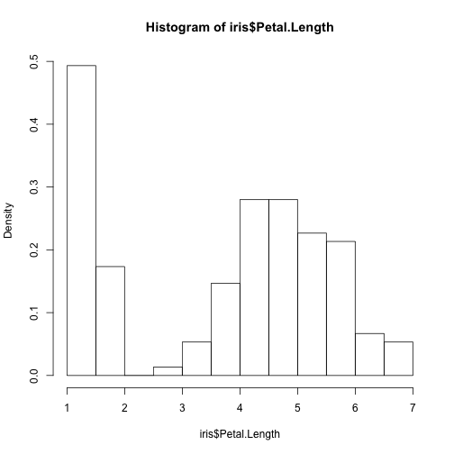
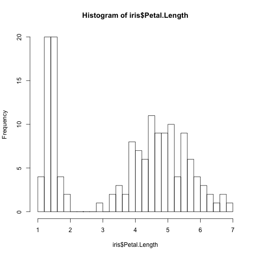
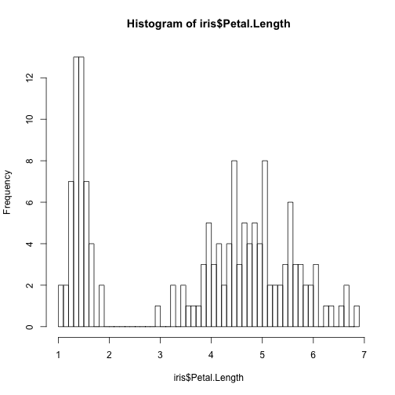
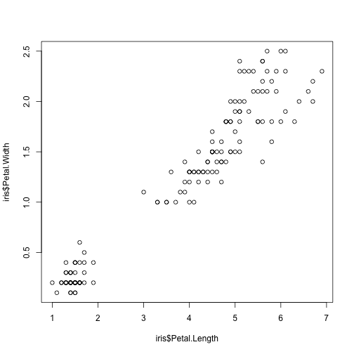

Introduction to R (part I)
========================================================
author: Paula Lissón 
date: October 2018

<small> 
Universität Potsdam   
Deparment of Linguistics
</small>

Contact : paula.lisson@uni-potsdam.de 


About me
========================================================
I'm a first year PhD candidate at Vasishth's lab, here in Potsdam. 

I will introduce you to the basics of R and to the main R functionalities you need to know in order to pass this course.

The slides for the tutorial and the homework are available here:
https://paulalisson.github.io/teaching.html

**About you: has anyone already used R?** This tutorial is designed for complete beginners.  

Intro: what is R?
========================================================

R is a powerful and very useful programming language, widely used
in and outside academia. Learning R has many advantages, for example:
- Statistical analysis for your research 
- Visualisation of data 
- In Linguistics, R also opens a new world of possibilities (text and speech analysis, computational semantics/pragmatics/psycholinguistics...)
- Also, once you learn one programming language it is easier to learn another one

What will you learn with me?
========================================================
- You will explore the basics of R and RStudio
- Basic types of objects (vectors, matrices...)
- Some R base functions and operations
- What packages are and how to install them 
- File paths, import and export data to/from R
- Some important warnings for beginners 
- Some more stuff you will need for this course (for loops; histograms...)

So, let's get started! 
========================================================

- I assume you have downloaded R and Rstudio
- If so, open Rstudio and follow the slides
- Otherwise, download R and Rstudio and pay attention to the slides


1. RStudio: let's create a project
========================================================


========================================================


========================================================


b) Let's explore RStudio
========================================================


========================================================


========================================================


Before we start: 
========================================================

- You should write your code in the *SCRIPT* 
- You run the code in your script with the shortcut **command + enter** (MAC) or **control + enter** (Windows), or by clicking the **"Run"** icon in the upper right corner of the script pannel 
- The output generated by the code will appear in the Console
- Scripts can be saved as .R files


Before we start: Some advice on formatting
========================================================
The **#** symbol in R is the indicator of a comment. That means that in your code, any line starting with # will be ignored by R (in Rstudio the line will be of a different color, green in the default confguration):
- Use the # to comment your code as much as possilbe, you should keep track of everything you do 
- Comments can also be reminders for yourself, i.e.: "TODO: revise this line of code", "Ask Paula about this error", "repeat this tomorrow". Remember, R will automatically skip it if it starts with #

Before we start: Some advice on formatting
========================================================
You can organize your script with headers so that you have a clear outline (and trust me, when the script is long, this is very useful). These are some possibilities:

```r
# 1. Intro to R ----------
# 2. Second class: intro to R part 2 --------
# 3. Normal distribution --------- 

#################### This is a header --
#-------- This is also a header -------
```

How to create an object in R
========================================================


Let's go!
========================================================
incremental: true

The first thing that you need to know is how to create and object.
Type the following examples (in your script), run the code (cmnd/cntrl + enter) 
and observe the difference (in your console):


```r
#example1 
myresult <- 4+5 
#example2 
3 + 3 
```

```
[1] 6
```

Why is there only one result displayed in the console? 

========================================================
incremental: true

Check the right upper pannel (environment) and you will see
that R has saved "myresult". You created an object with the
operator "<-". Now observe what happens in the console when
you type the name of the new object you've created.


```r
myresult
```

```
[1] 9
```


========================================================
incremental: true

For R, the object *myresult* is equivalent to the value you
have assigned to it (i.e. the result of 4+5). Look what happens
when we perform operations with the object:


```r
myresult - 3
```

```
[1] 6
```

```r
myresult
```

```
[1] 9
```
but why does *myresult* remain the same than before (9)
if we just subtracted -3 from it? 

========================================================
incremental: true

The reason is that the only way to modify that object 
is to reassign a new value to it (again, with the "<-").
Take a minute to thik about it. How would you create
a new object that contains the value of "myresult - 3"?


```r
myresult2 <- myresult - 3 # this way you do not overwrite the previous object "myresult", you create a new one instead with a different (meaningful) name
myresult2
```

```
[1] 6
```

========================================================
incremental: true
You can also perform operations with objects directly, such as:

```r
myresult2 * myresult # equivalent to 6 * 9
```

```
[1] 54
```

```r
myresult / myresult2 # equivalent to 9/6
```

```
[1] 1.5
```

```r
myresult2^2 # equivalent to 6^2
```

```
[1] 36
```

```r
sqrt(myresult) # quivalent to sqrt(9)
```

```
[1] 3
```


Objects
========================================================
incremental: true
If we overwrite the content of an object, its
content will change and its value won't be the initial one anymore, i.e.:

```r
myobject <- 3*2
myobject
```

```
[1] 6
```

```r
(myobject <- 400)
```

```
[1] 400
```

========================================================
Notice that the assign operator is always "<-" and NOT -> . Notice also that objects can contain numbers, but also characters:

```r
myobject <- "This is my object"
```


+ prompt
========================================================
- Sometimes (see image) the console in R displays a **+** sign instead of the usual **>**
- Due to a syntax error, R thinks that you aren't done and expects more code from you. 
- You can either finish the command or press the **esc** key:


A comment on errors.
========================================================

- Getting R errors will happen very often. **DON'T BE DISCOURAGED**
- When something is wrong, the console will display a message (sometimes in red). THIS IS VERY USEFUL. 
- With simple errors, if you copy and paste the error in google, you will get an answer. 
- But you should always try to interpret it yourself first

Example. Run the following code (wihtout the #). When do you get an error and why? 

```r
# myvariable <- 1
# myvariable2 <- apple 
# myvariable3 <- "apple"
```


Short practice
========================================================
incremental: true

- Add 85 to 156
- Subtract 200 to the result
- Multiply the result by 3
- Raise the result to the power of 2
- Which is the final result? 


```r
((((85+156)-200)*3)^2)
```

```
[1] 15129
```

Naming objects
========================================================
- Use meaningful names that describe the content of the object 
- Don't use extermely long names (very unpractical)
- Spaces are forbidden. E.g, use "means_group_3" or "MeansGroup3"
or "Means.Group.3" instead of "Means Group 3"
- Objects starting with a number or other symbols rather than letters (i.e. !myobject, 4_test) are also forbidden.

========================================================
- Capitalization matters, see:

```r
MY_object <- 45
MY_object
```

```
[1] 45
```
But if we type "my_object" instead of "MY_object" we get an error that looks like this:

```r
#Error in eval(expr, envir, enclos) : object 'my_object' not found
```

- Don't hesitate to check your environment (right upper panel) to see the objects you've created

Data types and R objects
========================================================
We will only focus on atomical vectors and data frames, but
it will be useful to recognise other object types (there
are more than the ones presented here):

1. Objects that can only store a single type of data (atomical vectors)
can be of type:
 - **Numerical**
 - **Character / strings (text)**
 - **Logical (True/False)**
 - **Factors** 

========================================================
2.These also store only one data type, but can have more than 1 dimension:
 - **Matrices (two dimensions)** 
 - **Arrays (2 or more dimensions)** <- no need to worry about this for now 
 
3.These can store more than one data type (i.e. numbers as numerical and strings as character):
 - **Lists** <- no need to worry about this for now 
 - **Data frames !!!!** 

Useful functions for any data type and any object:

```r
#class(nameoftheobject)
#length(nameoftheobject)
```

Data types and R objects: part I
========================================================
Today we will focus on:

1. Objects that can only store a single type of data (atomical vectors)
can be of type:
 - **Numerical**
 - **Character / strings (text)**
 - ~~Logical (True/False)~~
 - ~~Factors~~

 
Numerical vectors
========================================================
incremental: true

Examples

```r
myvector1 <- 1:10
myvector1
```

```
 [1]  1  2  3  4  5  6  7  8  9 10
```

```r
myvector2 <- c(1, 2, 3)
myvector2
```

```
[1] 1 2 3
```


======================================================
incremental: true


```r
myvector3 <- seq(from = 1, to = 10, by = 0.5)
myvector3
```

```
 [1]  1.0  1.5  2.0  2.5  3.0  3.5  4.0  4.5  5.0  5.5  6.0  6.5  7.0  7.5
[15]  8.0  8.5  9.0  9.5 10.0
```

```r
(myvector4 <- seq(1,10,0.5)) # same than in previous but shorter
```

```
 [1]  1.0  1.5  2.0  2.5  3.0  3.5  4.0  4.5  5.0  5.5  6.0  6.5  7.0  7.5
[15]  8.0  8.5  9.0  9.5 10.0
```

* Notice the use of parenthesis at the beginning and end of myvector4: if we enclose everything in parenthesis, R will automatically display the output even if it is in an object 

Character vectors
======================================================
incremental: true

Examples

```r
strings <- c("this","is","my","text")
nchar(strings)
```

```
[1] 4 2 2 4
```

```r
class(strings)
```

```
[1] "character"
```

======================================================
incremental: true

Note that we can explicitly tell R to change the data type:

```r
myvector <- 1:10
class(myvector)
```

```
[1] "integer"
```

```r
as.character(myvector)
```

```
 [1] "1"  "2"  "3"  "4"  "5"  "6"  "7"  "8"  "9"  "10"
```

```r
as.numeric("1") # remember that everything enclosed in "" is normally character
```

```
[1] 1
```


Subsetting and more operations with vectors
========================================================
incremental: true

* To get a particular element (or sequences of elements) in a vector, we use square brackets []


```r
myvector <- 10:1
myvector[3] # we are asking for the third element of the vector, i.e. 8 
```

```
[1] 8
```

```r
myvector[3:6]
```

```
[1] 8 7 6 5
```

========================================================
incremental: true
* Guess what the following code will output (the **c** is for "concatenating"):

```r
myvector <- 10:1
myvector[c(1,3,5)]
```

```
[1] 10  8  6
```

* and this?

```r
x <- 1:20
x
```

```
 [1]  1  2  3  4  5  6  7  8  9 10 11 12 13 14 15 16 17 18 19 20
```

========================================================
incremental: true
What will the following code output?

```r
x[-(2:4)]
```

```
 [1]  1  5  6  7  8  9 10 11 12 13 14 15 16 17 18 19 20
```
And this one? (the **c** is for "concadenating")

```r
x[c(1, 5)]
```

```
[1] 1 5
```

========================================================
incremental: true
What about this one?

```r
rep(1:4, times=3)
```

```
 [1] 1 2 3 4 1 2 3 4 1 2 3 4
```

And this one?

```r
rep(1:2, each=3)
```

```
[1] 1 1 1 2 2 2
```


========================================================
incremental: true

* When we multiply/divide/sum/subtract/raise a vector by a number, every item of the vector gets the operation:

```r
myvector <- 1:10
(result <- myvector *2)
```

```
 [1]  2  4  6  8 10 12 14 16 18 20
```
* when we multiply/divide/sum/subtract/raise a vector by another vector, observe what happens:

```r
x <- c(1,3)
y <- c(2,4)
x*y
```

```
[1]  2 12
```


Functions
========================================================
incremental: true
Functions are pieces of code that do something specific, with or without parameters. In (base) R, there are many built-in functions, this means that you don't have to create them; you can simply use them. Some useful functions are: 

```r
rm(myobject) # erases the object
sqrt(5) # square root
```

```
[1] 2.236068
```

```r
rep(1,7) # notice the two arguments here (because the order matters!); this means "repeat seven times the number one"
```

```
[1] 1 1 1 1 1 1 1
```


========================================================
incremental: true
As we have seen, the c() function concatenates its arguments, for example:

```r
fruits <- c("orange","banana","apple")
fruits
```

```
[1] "orange" "banana" "apple" 
```

```r
values_group1 <- c(23,32,45,56,33,43)
```

========================================================
incremental: true
We can compute the mean and the standard deviation with the functions **mean()** and **sd()**:


```r
mean(values_group1)
```

```
[1] 38.66667
```

```r
sd(values_group1)
```

```
[1] 11.67333
```
You can nest functions within others, so for example, what do you think the following code will do?

```r
round(mean(values_group1))
```

```
[1] 39
```

========================================================
incremental: true

The function summary() calculates basic summary statistics:

```r
summary(values_group1)
```

```
   Min. 1st Qu.  Median    Mean 3rd Qu.    Max. 
  23.00   32.25   38.00   38.67   44.50   56.00 
```


Help
========================================================
R has a help function, which consists on typing a **?** before the function you want to know more about. You can also do this with the function **help()**.

Type the following code and observe what happens in the lower panel to the right:

```r
?rnorm #equivalent to help(rnorm)
```

You should get now the description of the funtion, its usage, arguments, some details, examples and references. If you can't get what you wanted, try **??** (i.e. > ??rnorm).

Now I want to draw your attention to the very first line on the left corner of the panel:

>normal{stats}

The {stats} part indicates that the function we searched belongs to the package {stats}. If we want to use that function, we have to have installed and loaded the package **stats**

Packages
========================================================
- Packages are essentially collections of functions that are not implemented in base R
- Once you have downloaded and loaded the package, you can use all the functions of the package. 
- All the "official" packages are stored in **CRAN** (Comprehensive R Archive Network), and there are thousands of them. Have a look at: https://cran.r-project.org/web/views/NaturalLanguageProcessing.html

- R is open source, and free: anyone can contribute with her own code/package. That is what makes R so **great**.


Downloading and loading packages
========================================================
- You only need to download a package once 
- But every time you open Rstudio, you need to load it, otherwise it won't work


```r
install.packages("stats") # ONLY ONCE
library(stats) # every time you open a session
```

**NOW**: download the **knitr** package (we will need it for the homework)

```r
# install.packages("knitr")
```


Plotting: Histograms
========================================================
R has several built-in datasets (for practice/didactics purposes). We will use the dataset **iris** to produce simple graphs. First, load the dataset by doing **data(iris)**, and see how it looks like by using the function summary() and/or head().

```r
#summary(iris)
#head(iris)
```

Plotting: Histograms
========================================================
* A histogram is simply a way to graphically explore the distribution of a numerical vairable


```r
hist(iris$Petal.Length,freq=F)
```




Plotting: Histograms
========================================================

```r
hist(iris$Petal.Length,breaks=30)
```




========================================================

```r
hist(iris$Petal.Length,breaks=50)
```




Plotting: Scatter plots 
========================================================
incremental: true

An way to observe the relationship between two numeric variables:

```r
plot(iris$Petal.Length, iris$Petal.Width)
```



========================================================
incremental: true

Given the scatter plot in the previous slide, what can we observe about the relationship between Petal Lenght and Petal Width?
* This can be also checked numerically:

```r
cor(iris$Petal.Length, iris$Petal.Width)
```

```
[1] 0.9628654
```


Just for fun: have a look at some of the plots you can do with R 
========================================================

https://www.r-graph-gallery.com/histogram/

http://www.r-graph-gallery.com/21-distribution-plot-using-ggplot2

https://www.r-graph-gallery.com/129-use-a-loop-to-add-trace-with-plotly/

General guidelines
========================================================
- **NEVER NEVER NEVER** use Word, LibreOffice, or PPT to write code. If you don't like Rstudio, you could use a text editor such as Atom, Aquamacs, or even the text editor by default in your computer. BUT DON'T USE WORD.
- Try to comment your code as you are doing it, it will be useful for you in the future
- If you consult online sites and copy and paste the code, always put in a comment (#) the reference to the original source

========================================================
- Don't get stressed out or mad at R. Learning a programming language takes time, effort, and a lot of mistakes. All of that is normal. Take a breath and a break if you start to get angry or feel that you cannot deal with R
- Don't be afraid of asking questions, either online, to your classmates, or to me


Note
========================================================
Often, there are many many ways of obtaining the same result with R. That is, there are many possible alternative functions to get to the same goal. The functions I am showing you here are very basic and by no means the only way to get to the results. If you find other possibilities when consulting forums online or in reference books, that's fine. I don't want you to get overwhelmed, so I'm just showing you one way to do things, but if you want to learn more ways, that's perfect. 

Online resources
========================================================
incremental: true
R has a huge and generally quite friendly commuinity. Some online useful 
resources are:

- Stackoverflow (you will find most answers in this site when you google errors)
- Rstudio.com/resources
- RGraph gallery 
- Twitter! (check #rstats #rladies #rstudio)
- R meetups in general, and Rladies
- Learning Statistics with R: a tutorial for psychology students and other beginners, by Danielle Navarro: http://www.fon.hum.uva.nl/paul/lot2015/Navarro2014.pdf

Homework
========================================================
Homework is available in Moodle, we will use R notebooks. 
Alternatively, use this link to get to the homework (and lecture notes):

https://paulalisson.github.io/teaching.html

The R notebook contains the instructions to do the homework. Once you are done with the homework, knit it to HTML and upload it to moodle. Please, name it with your own surname and name in the following format: LissonPaulaH1 for homework 1 and LissonPaulaH2 for homework 2.

Instructions:
========================================================
1. Download the .Rmd file from my website
2. MAKE SURE that you save it as a .Rmd file
3. Open the file with Rstudio
4. The file contains exercises and the instructions
5. Once you finish the homework, you have to knit the file to HTML
(knit button on Rstudio, on top of the script)
