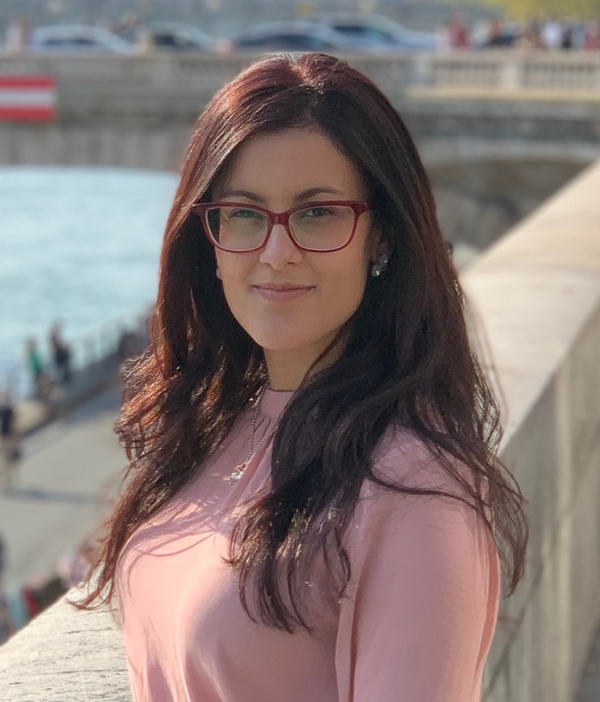

# Contact
Department of Linguistics, Universität Postdam. 
Karl-Liebknecht-Straße 24–25, 14476 Potsdam.   
Haus 14, Room 212.  
Email: paula.lisson@ uni-potsdam.de / lissonh@ gmail.com  
Profiles: [ORCID](https://orcid.org/0000-0003-4750-2553), [Twitter](https://twitter.com/lissonpaula)

# About me
I'm a PhD candidate in Cognitive Sciences in the [Vasishth's Lab](http://www.ling.uni-potsdam.de/~vasishth/), at the University of Potsdam, in Germany. I am currently working on computational models of sentence processing in aphasia, within the project B02 of the [SFB 1287 - Limits of Variability in Language](https://www.uni-potsdam.de/sfb1287/index.html). In my research I use Bayesian methods and the cognitive architecture ACT-R. 

Previously, I completed a MA in English Linguistics at Paris Diderot University ([CLILLAC-ARP EA 3967 lab](http://www.clillac-arp.univ-paris-diderot.fr)), and I was a visiting student at [NYU Linguistics](https://as.nyu.edu/content/nyu-as/as/departments/linguistics/homepage.html) in 2017-2018. During this period, my research mainly focused on lexical and syntactic complexity in learners of English, and on crosslinguistic transfers in multilingual learners. I also worked on the statistical modeling of relativizer choices among French learners of English (under the supervision of [Nicolas Ballier](http://www.clillac-arp.univ-paris-diderot.fr/user/nicolas_ballier). Prior to that, I completed a BA on English and French Philology at the University of Las Palmas de Gran Canaria, in Spain. 
